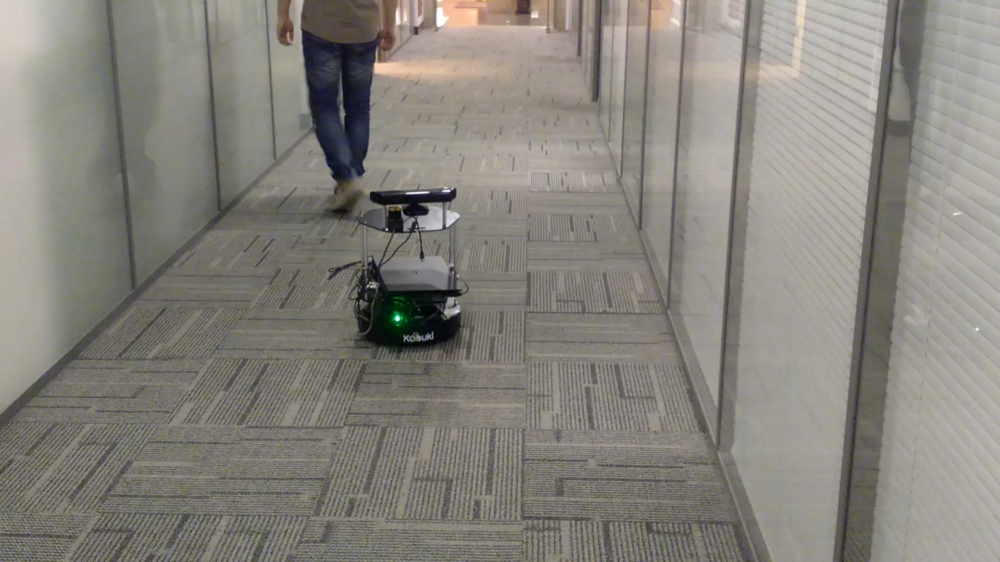

# 利用Kinect进行KCF目标追踪在[ROS](http://www.ros.org)下的在线实现及在Turtlebot 2平台上的验证
   该代码为硕士论文《基于视觉追踪的跟随机器人研究》部分实验代码，旨在进行Turtlebot 2平台上的视觉伺服。‘

实验视频观看地址：[Turtlebot 2 视觉伺服](http://v.youku.com/v_show/id_XMTU2NjEyODQ2OA==.html?tpa=dW5pb25faWQ9MTAzMjUyXzEwMDAwMV8wMV8wMQ)
## 1.KCF目标追踪
#### 参考文献：
* HENRIQUES J F, CASEIRO R, MARTINS P, et al.. High-speed tracking with kernelized correlation filters [J]. IEEE Transactions on Pattern Analysis and Machine Intelligence, 2015, 37(3): 583-596.
* BOLME D S, BEVERIDGE J R, DRAPER B A, et al.. Visual object tracking using adaptive correlation filters[C]. 23rd IEEE Conference on Computer Vision and Pattern Recognition(CVPR), 2010, 13-18.
* 原始实现：[Klaus Haag](https://github.com/klahaag/cf_tracking). 十分感谢！

## 2.双轮差速控制
#### 通过RGB图像目标追踪获取的目标位置与Depth图像获取的目标距离对Turtlebot进行伺服控制。

## Contributor
-------------------
- 张子洋: [zzy@mpig.com.cn](zzy@mpig.com.cn)

---------
Cheers!
:panda_face:
